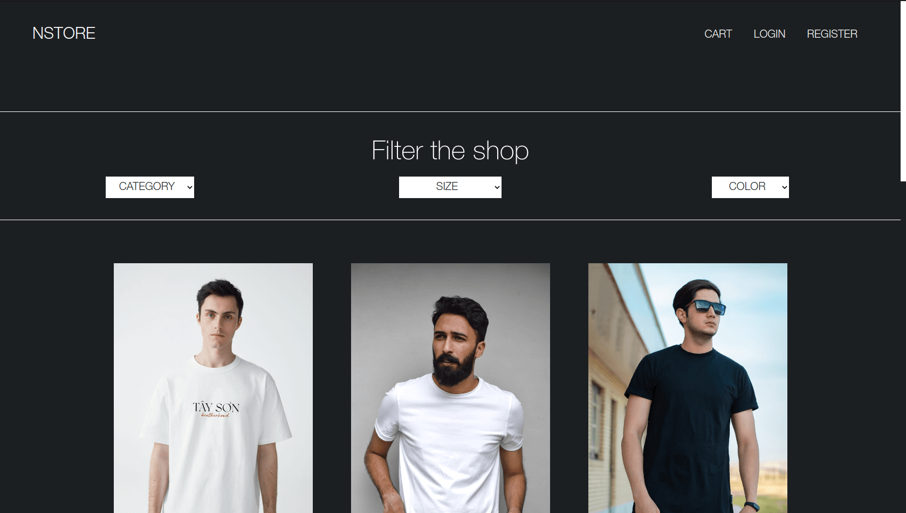
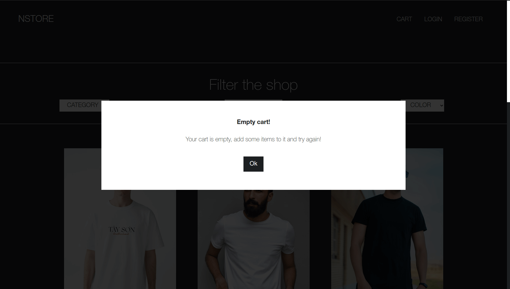
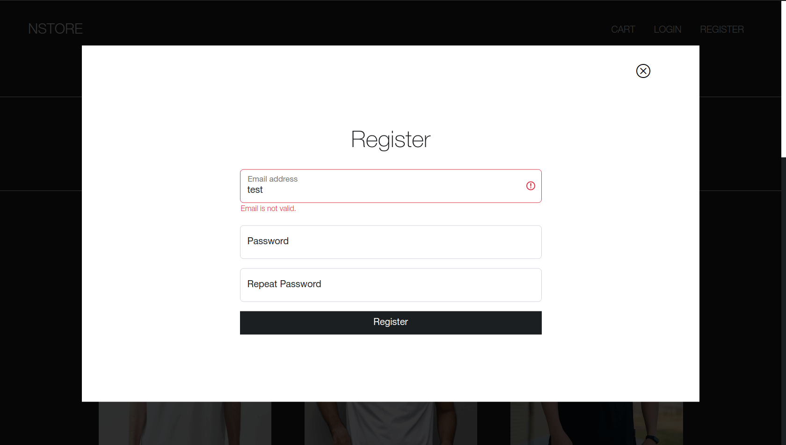

# Web Shop App

This is my web shop application made with Bootstrap and Vanilla js.

## Functionalities

It has the following functionalities:

- Login
- Register
- Order
  - Add item to cart
  - Remove item from cart
  - Send order to database
- Filter
  - Category
  - Size
  - Color

## Screenshots and details

### Main page

### Error messages

### Form

## More info

I used the design from [dribbble](https://dribbble.com/shots/15163938-Fashion-E-commerce-Landing-Page "Dribbble design") for inspiration. For backend I used mock api. The app is fully responsive. When user logs in or registers his session will expire in 30 minutes.
